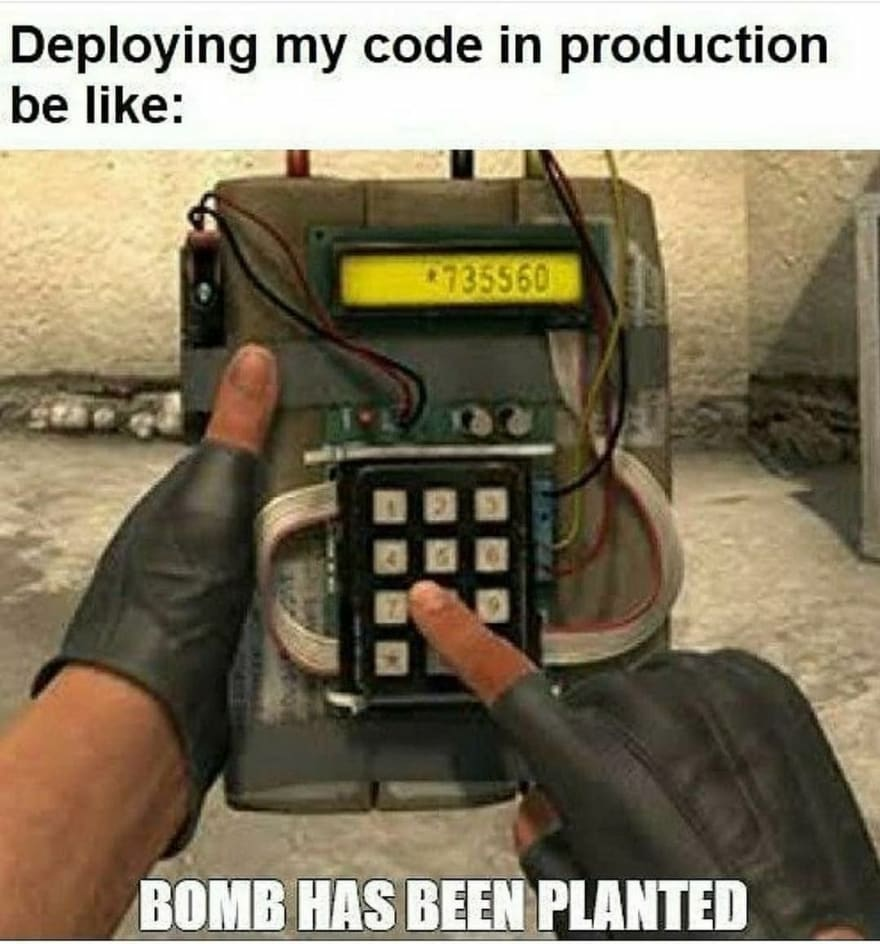

## Doctor House Frase telegram bot


Este es un pequeño proyecto de construir un bot de telegram donde se muestran las frases famosas de sarcasmo del dr house.

Puedes probar su funcionamiento en [telegram](https://web.telegram.org/z/#5664340559)

Para ello he seguido los siguientes pasos

- Instalación de módulos
- Obtener el TOKEN
- Escribir en el archivo bot.py el codigo
- Probar la aplicación en local
- Subir los cambios a github
- Hacer el deploy en heroku 
- Documentar el codigo

### Instalacion de modulos 

installing via pip

```sh
pip install python-telegram-bot
```

 installing via conda
 
```sh
conda install -c conda-forge python-telegram-bot
```

## Obtener el TOKEN
abrir telegram y buscar "BotFather" (oficial). Este bot es el encargado de generar otros bot y el Token id 
Haz click en  ‘BotFather’ (first result) y escribe /newbot
luego te pedira que escribas un nombre para tu bot que debe de terminar con la palabra bot al final Ejem: bio_bot, hellobot, my_bot etc
finalmente copiar el TOKEN 

 ## Escribir en el archivo bot.py el codigo
 
  
```python

from dataclasses import dataclass
from telegram.ext.updater import Updater
from telegram.update import Update
from telegram.ext.callbackcontext import CallbackContext
from telegram.ext.commandhandler import CommandHandler
from telegram.ext.messagehandler import MessageHandler
from telegram.ext.filters import Filters
import json 
import random as rd
from googletrans import Translator

import os
from dotenv import load_dotenv
load_dotenv('.env')
TOKEN = os.getenv('TOKEN')
translator = Translator(service_urls=['translate.googleapis.com'])

updater = Updater(TOKEN, use_context=True)

def getData():
    #lee el archivo quote.json 
    with open('quote.json') as file:
        data = json.load(file)
    return data

def getRandomQuote(data):
    # función que genera un número aleatorio de 0 hasta la longitud del quote.json
    # y asigna ese número a la frase. generando una frase aleatoria
    length = len(data['quotes'])
    l = rd.randint(0,length)
    return (data['quotes'][l]['quote'])

def start(update: Update, context: CallbackContext):
    #Función de inicio: mostrará la primera conversación, el mensaje que contiene se enviará al usuario cada vez que presione 'iniciar' al principio.

    chat_id = update.message.chat_id
    username = update.message.chat.first_name
    update.message.reply_text(
		f"Hola {username} 🤗, Bienvenido al bot de las frases del Dr House bot. Recuerda que todos mienten ")
    update.message.reply_text(f"Hi {username} 🤗 Welcome to Dr House quotes. Remenber Everybody lies")
    update.message.reply_text("new quote | nueva frase /quote")
    update.message.reply_text("help | ayuda /help")


def quote(update: Update, context: CallbackContext):
    #Función que llama a la función generadora de frases y la envía a telegram. Además hace traduccion de la frase
    data = getData()
    q = getRandomQuote(data)
    q = "".join(q)
    translation = translator.translate(q, dest='es')
    update.message.reply_text(q)
    #print(translation.text)
    update.message.reply_text(translation.text)


def help(update: Update, context: CallbackContext):
    #función de ayuda se muestran los comandos que lee el bot
    update.message.reply_text("""Available Commands :-
    /github - To get the source code URL
    /quote - To get Dr House Quote""")

def github(update: Update, context: CallbackContext):
     update.message.reply_text(
        "github URL => https://github.com/edwight-delgado/dr_house_quote_telegram-bot")

def unknown(update: Update, context: CallbackContext):
    update.message.reply_text("Sorry '%s' is not a valid command" % update.message.text)
  
  
def unknown_text(update: Update, context: CallbackContext):
    update.message.reply_text(
        "Sorry I can't recognize you , you said '%s'" % update.message.text)
  
def main():
   
    updater.dispatcher.add_handler(CommandHandler('start', start))
    updater.dispatcher.add_handler(CommandHandler('help', help))
    updater.dispatcher.add_handler(CommandHandler('quote', quote))
    updater.dispatcher.add_handler(MessageHandler(Filters.text, unknown))
    updater.dispatcher.add_handler(MessageHandler(
        Filters.command, unknown))  # Filters out unknown commands
    
    # Filters out unknown messages.
    updater.dispatcher.add_handler(MessageHandler(Filters.text, unknown_text))
    
    updater.start_polling()

    updater.idle()

if __name__ == '__main__':
    main()

```


<p>Además necesitaremos un archivo .env el cual contiene </p>
TOKEN=" ....."
HEROKU_APP_NAME="telegram-dr-house-bot" 

Para ejecutar el script en local solo tienes que escribir 

```sh
python bot.py
```

<p>Ir a telegram, iniciar el bot y escribir ** /start ** si todo esta bien tomate un café de mi parte XD</p>


## Subir los cambios a github
<p>Ahora hay que subir los cambios a github. Esto es fácil. creas un repositorio y subes los cambios</p>

```sh
git init
git add .
git commit -m "bot de telegram para iniciar el apocalipsis zombies"
git branch -M main
git remote add origin git@github.com:edwight-delgado/test.git #tu repositorio
git push -u origin main
```
y listo. Lo próximo es usar heroku

## Hacer el deploy en heroku 
Es necesario tener un archivo con todos los módulos y versiones de los paquetes usado en el proyecto.

```sh
pip freeze > requirements.txt
```

### Lo segundo es crear un archivo **Procfile**
<p>Procfile es un archivo de texto que define el comando que debe de ejecutar heroku cuando la aplicación se ejecuta
en este caso se quiere que se ejecute el archivo bot.py </p>
<p>por lo que en Procfile se escribe </p>

```sh
web: python bot.py 
```

### Modificamos el archivo bot.py 
Reemplazamos  **updater.start_polling()** con el siguiente fragmento de código:

```python
PORT = int(os.environ.get('PORT','8443'))
HEROKU_APP_NAME = os.environ.get('HEROKU_APP_NAME')
updater.start_webhook(listen="0.0.0.0",
                      port=PORT,
                      url_path= TOKEN,
		      webhook_url=f"https://{HEROKU_APP_NAME}.herokuapp.com/{TOKEN}")
    
    
```

<p>Todo lo demas queda igual </p>

<p>Luego use los siguientes comandos para subir los cambios a github</p>

```sh
git add .
git commit -m "bot de telegram listo para despliegue"
git push -u origin main
```

### Finalmente en heroku 
<p>Create una nueva app con el mismo nombre del proyecto </p>
<p>Conectarse con github y buscar el nombre del repositorio en mi caso telegram-bot-dr-house-quote </p>


<p>Luego ir a setting y en config var establecer las variables de entorno </p> 

<p>Finalmente hacer el deploy</p>


# Gracias por Llegar hasta Aquí 

